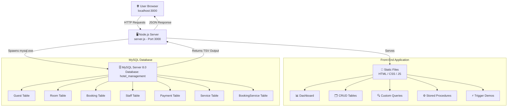
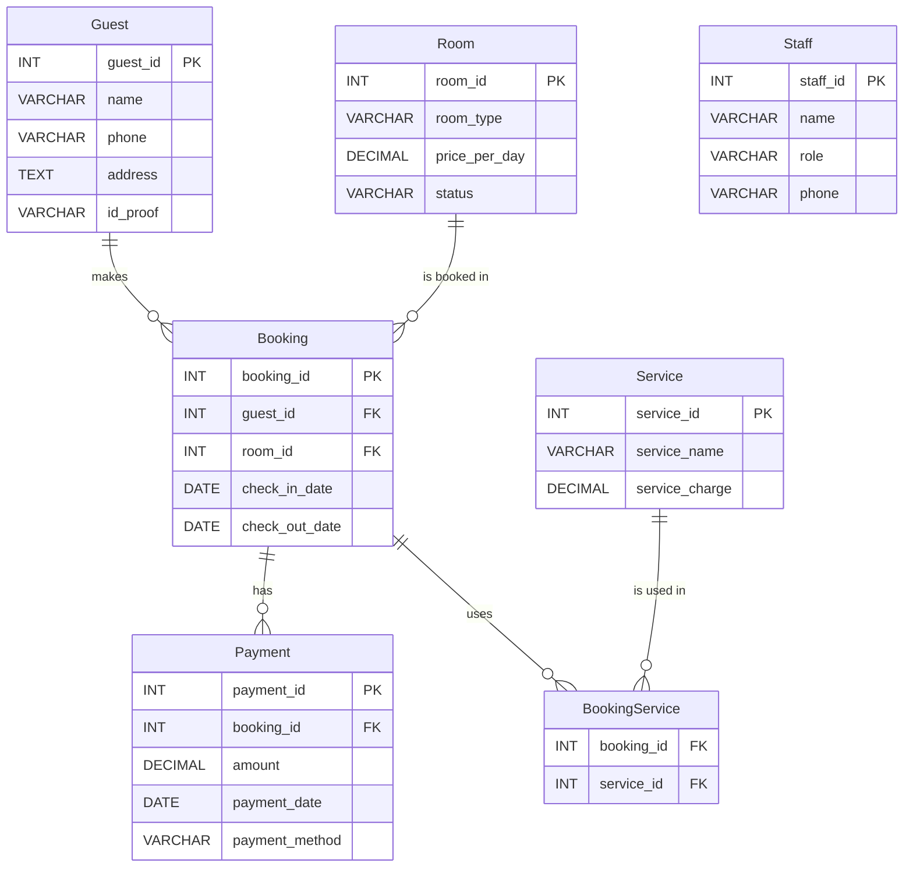
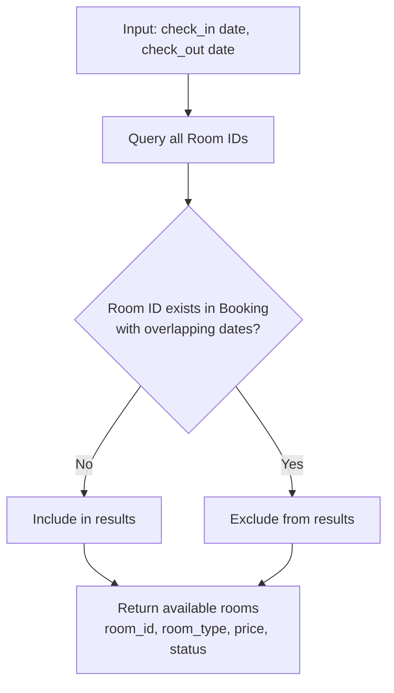
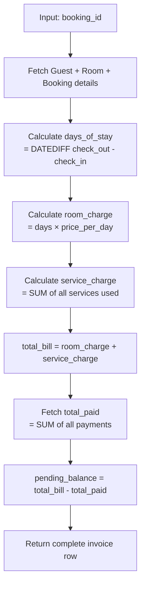
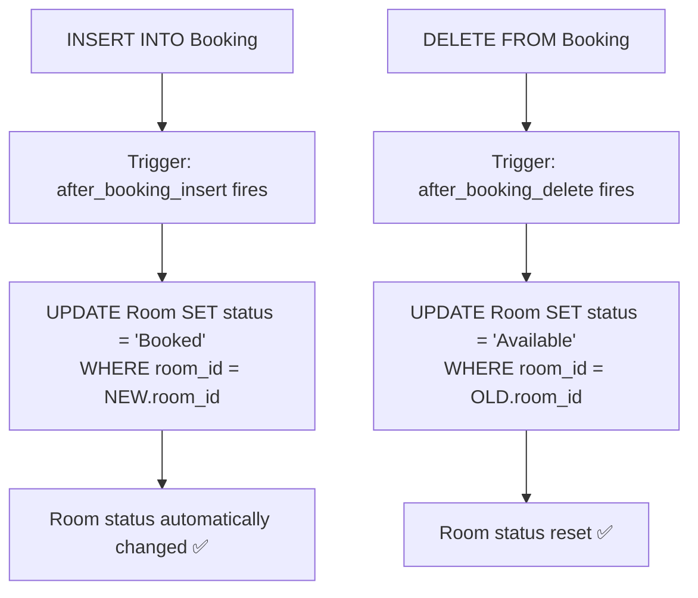
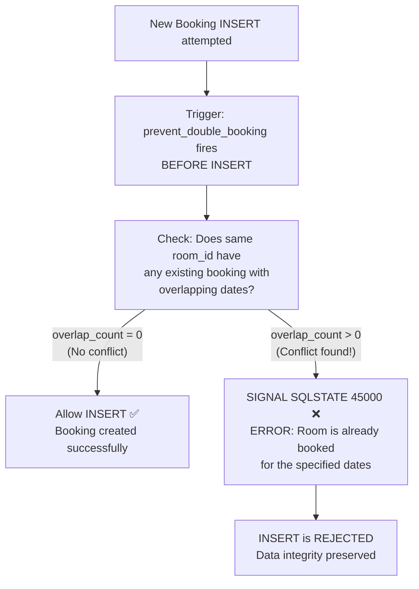
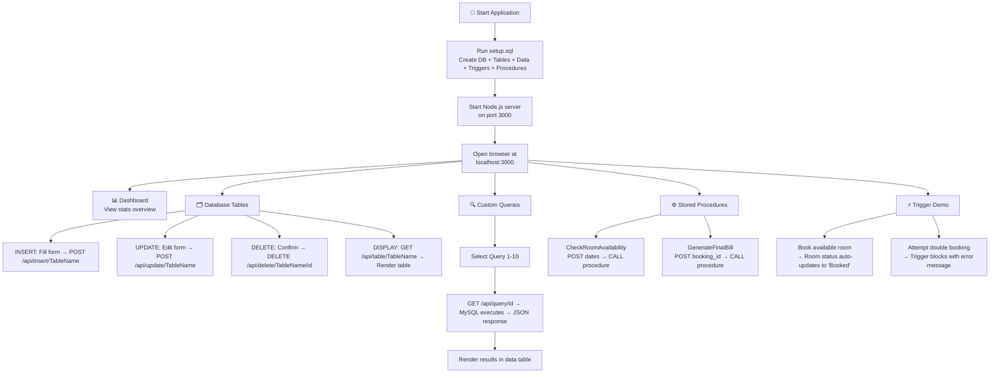
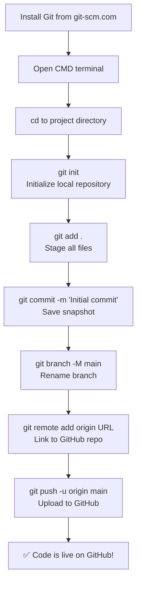

# 🏨 Hotel Management System — DBMS Project 

A complete **Database Management System** project built with **MySQL 8.0** and a **web-based front-end application**. This project demonstrates database design, normalization, CRUD operations, advanced SQL queries (JOINs, Subqueries, GROUP BY, HAVING, NOT EXISTS), stored procedures, and triggers — all accessible through an interactive UI.

---

## 📁 Project Structure

```
hotel-management-system/
│
├── setup.sql            # Complete database script (schema + data + triggers + procedures)
├── server.js            # Node.js backend API server
├── verify.js            # Automated database verification tests
├── run.ps1              # One-click PowerShell launcher (seeds DB + starts server)
├── README.md            # Project documentation (this file)
│
└── public/              # Front-end application
    ├── index.html       # Main HTML page with all UI panels
    ├── style.css        # Premium glassmorphic CSS design
    └── app.js           # Client-side JavaScript (AJAX, DOM manipulation)
```

---

## 🔄 System Architecture Flowchart



---

## 📊 Entity-Relationship Diagram



---


## 📝 Sample Data Inserted

| Table | Records | Details |
|-------|---------|---------|
| Guest | 5 | John Doe, Jane Smith, Bob Johnson, Alice Brown, Charlie Green |
| Room | 27 | 22 Standard ($80), 3 Deluxe ($150), 2 Suite ($300) |
| Booking | 5 | Various check-in/out dates across June 2026 |
| Staff | 4 | Manager, 2 Receptionists, Sales Rep |
| Payment | 5 | Credit Card, Cash, Debit Card, Bank Transfer |
| Service | 5 | Room Service, Airport Shuttle, Spa, Laundry, Valet Parking |
| BookingService | 5 | Mapping services consumed per booking |

---

## 🔍 SQL Queries (10 Queries with Answers)

### Query 1: Retrieve all guests
```sql
SELECT guest_id, name, phone, address, id_proof FROM Guest;
```
| guest_id | name | phone | address | id_proof |
|----------|------|-------|---------|----------|
| 1 | John Doe | 9876543210 | 123 Maple Street, NY | PASSPORT123 |
| 2 | Jane Smith | 8765432109 | 456 Oak Ave, LA | DL45678 |
| 3 | Bob Johnson | 7654321098 | 789 Pine Road, CH | AADHAR9876 |
| 4 | Alice Brown | 6543210987 | 321 Elm Lane, SF | PASSPORT456 |
| 5 | Charlie Green | 5432109876 | 654 Birch Court, SE | DL98765 |

---

### Query 2: Display rooms of a specific room type
```sql
SELECT room_id, room_type, price_per_day, status
FROM Room WHERE room_type = 'Deluxe';
```
| room_id | room_type | price_per_day | status |
|---------|-----------|---------------|--------|
| 23 | Deluxe | 150.00 | Booked |
| 24 | Deluxe | 150.00 | Booked |
| 25 | Deluxe | 150.00 | Booked |

---

### Query 3: Display booking and guest details (2-Table INNER JOIN)
```sql
SELECT b.booking_id, g.guest_id, g.name AS guest_name, g.phone,
       b.room_id, b.check_in_date, b.check_out_date
FROM Booking b
INNER JOIN Guest g ON b.guest_id = g.guest_id;
```
| booking_id | guest_id | guest_name | phone | room_id | check_in_date | check_out_date |
|------------|----------|------------|-------|---------|---------------|----------------|
| 1 | 1 | John Doe | 9876543210 | 1 | 2026-06-10 | 2026-06-15 |
| 2 | 2 | Jane Smith | 8765432109 | 2 | 2026-06-12 | 2026-06-14 |
| 3 | 3 | Bob Johnson | 7654321098 | 23 | 2026-06-08 | 2026-06-18 |
| 4 | 1 | John Doe | 9876543210 | 24 | 2026-06-20 | 2026-06-25 |
| 5 | 4 | Alice Brown | 6543210987 | 25 | 2026-06-11 | 2026-06-15 |

---

### Query 4: Display booking, guest, and room details (3-Table JOIN)
```sql
SELECT b.booking_id, g.name AS guest_name, r.room_id, r.room_type,
       r.price_per_day, b.check_in_date, b.check_out_date
FROM Booking b
JOIN Guest g ON b.guest_id = g.guest_id
JOIN Room r ON b.room_id = r.room_id;
```
| booking_id | guest_name | room_id | room_type | price_per_day | check_in_date | check_out_date |
|------------|------------|---------|-----------|---------------|---------------|----------------|
| 1 | John Doe | 1 | Standard | 80.00 | 2026-06-10 | 2026-06-15 |
| 2 | Jane Smith | 2 | Standard | 80.00 | 2026-06-12 | 2026-06-14 |
| 3 | Bob Johnson | 23 | Deluxe | 150.00 | 2026-06-08 | 2026-06-18 |
| 4 | John Doe | 24 | Deluxe | 150.00 | 2026-06-20 | 2026-06-25 |
| 5 | Alice Brown | 25 | Deluxe | 150.00 | 2026-06-11 | 2026-06-15 |

---

### Query 5: Count number of rooms per room type (GROUP BY)
```sql
SELECT room_type, COUNT(*) AS room_count
FROM Room GROUP BY room_type;
```
| room_type | room_count |
|-----------|------------|
| Standard | 22 |
| Deluxe | 3 |
| Suite | 2 |

---

### Query 6: Display room types having more than 20 rooms (HAVING)
```sql
SELECT room_type, COUNT(*) AS room_count
FROM Room GROUP BY room_type
HAVING COUNT(*) > 20;
```
| room_type | room_count |
|-----------|------------|
| Standard | 22 |

---

### Query 7: Guests whose total payment > average payment (Subquery)
```sql
SELECT g.guest_id, g.name, g.phone, SUM(p.amount) AS total_payment
FROM Guest g
JOIN Booking b ON g.guest_id = b.guest_id
JOIN Payment p ON b.booking_id = p.booking_id
GROUP BY g.guest_id, g.name, g.phone
HAVING total_payment > (SELECT AVG(amount) FROM Payment);
```
| guest_id | name | phone | total_payment |
|----------|------|-------|---------------|
| 1 | John Doe | 9876543210 | 700.00 |
| 3 | Bob Johnson | 7654321098 | 1000.00 |

---

### Query 8: Guests who made more bookings than a specific guest (Correlated Subquery)
```sql
SELECT g.guest_id, g.name,
       (SELECT COUNT(*) FROM Booking b WHERE b.guest_id = g.guest_id) AS booking_count
FROM Guest g
WHERE (SELECT COUNT(*) FROM Booking b WHERE b.guest_id = g.guest_id) >
      (SELECT COUNT(*) FROM Booking b2 WHERE b2.guest_id = 2);
```
> Comparing against Guest ID 2 (Jane Smith — 1 booking). Returns guests with more than 1 booking:

| guest_id | name | booking_count |
|----------|------|---------------|
| 1 | John Doe | 2 |

---

### Query 9: Display all rooms including those not booked (LEFT JOIN)
```sql
SELECT r.room_id, r.room_type, r.price_per_day, r.status AS current_status,
       b.booking_id, b.check_in_date, b.check_out_date
FROM Room r
LEFT JOIN Booking b ON r.room_id = b.room_id;
```
> Returns all 27 rooms. Rooms without bookings show `NULL` for booking columns.

| room_id | room_type | price_per_day | current_status | booking_id | check_in | check_out |
|---------|-----------|---------------|----------------|------------|----------|-----------|
| 1 | Standard | 80.00 | Booked | 1 | 2026-06-10 | 2026-06-15 |
| 2 | Standard | 80.00 | Booked | 2 | 2026-06-12 | 2026-06-14 |
| 3 | Standard | 80.00 | Available | NULL | NULL | NULL |
| ... | ... | ... | ... | ... | ... | ... |

---

### Query 10: Retrieve services never used in any booking (NOT EXISTS)
```sql
SELECT s.service_id, s.service_name, s.service_charge
FROM Service s
WHERE NOT EXISTS (
    SELECT 1 FROM BookingService bs WHERE bs.service_id = s.service_id
);
```
| service_id | service_name | service_charge |
|------------|--------------|----------------|
| 4 | Laundry Service | 15.00 |
| 5 | Valet Parking | 20.00 |

---

## ⚙️ Stored Procedures

### Procedure 1: Check Room Availability

Accepts a date range and returns all rooms with **no overlapping reservations**.

```sql
DELIMITER $$
CREATE PROCEDURE CheckRoomAvailability(IN check_in DATE, IN check_out DATE)
BEGIN
    SELECT room_id, room_type, price_per_day, status
    FROM Room
    WHERE room_id NOT IN (
        SELECT room_id FROM Booking
        WHERE check_in < check_out_date AND check_out > check_in_date
    );
END$$
DELIMITER ;
```

**Example Usage:**
```sql
CALL CheckRoomAvailability('2026-06-11', '2026-06-15');
```

**Flowchart:**


---

### Procedure 2: Generate Final Bill

Calculates the complete invoice for a guest's booking.

```sql
DELIMITER $$
CREATE PROCEDURE GenerateFinalBill(IN p_booking_id INT)
BEGIN
    -- Retrieves guest name, room type, price per day, check-in/out dates
    -- Calculates: days_of_stay = DATEDIFF(check_out, check_in)
    -- Calculates: room_charge = days_of_stay × price_per_day
    -- Calculates: service_charge = SUM of all services used via BookingService
    -- Calculates: total_bill = room_charge + service_charge
    -- Calculates: total_paid = SUM of all payments for this booking
    -- Calculates: pending_balance = total_bill - total_paid
    -- Returns all values as a single result row
END$$
DELIMITER ;
```

**Example Usage & Output:**
```sql
CALL GenerateFinalBill(1);
```
| booking_id | guest_name | room_type | price_per_day | check_in | check_out | days | room_charge | service_charge | total_bill | total_paid | pending |
|------------|------------|-----------|---------------|----------|-----------|------|-------------|----------------|------------|------------|---------|
| 1 | John Doe | Standard | 80.00 | 2026-06-10 | 2026-06-15 | 5 | 400.00 | 65.00 | 465.00 | 400.00 | 65.00 |

**Flowchart:**


---

## ⚡ Triggers

### Trigger 1: Auto-Update Room Status After Booking

```sql
DELIMITER $$
CREATE TRIGGER after_booking_insert
AFTER INSERT ON Booking
FOR EACH ROW
BEGIN
    UPDATE Room SET status = 'Booked' WHERE room_id = NEW.room_id;
END$$

CREATE TRIGGER after_booking_delete
AFTER DELETE ON Booking
FOR EACH ROW
BEGIN
    UPDATE Room SET status = 'Available' WHERE room_id = OLD.room_id;
END$$
DELIMITER ;
```

**Flowchart:**


---

### Trigger 2: Prevent Double Booking of the Same Room

```sql
DELIMITER $$
CREATE TRIGGER prevent_double_booking
BEFORE INSERT ON Booking
FOR EACH ROW
BEGIN
    DECLARE overlap_count INT;

    SELECT COUNT(*) INTO overlap_count FROM Booking
    WHERE room_id = NEW.room_id
      AND NEW.check_in_date < check_out_date
      AND NEW.check_out_date > check_in_date;

    IF overlap_count > 0 THEN
        SIGNAL SQLSTATE '45000'
        SET MESSAGE_TEXT = 'SQL Trigger Blocked: Room is already booked for the specified dates.';
    END IF;
END$$
DELIMITER ;
```

**Flowchart:**


---

## 🖥️ Front-End Application Features

The web application provides a complete interactive interface:

| Tab | Feature | Operations |
|-----|---------|------------|
| **📊 Dashboard** | Overview panel | Displays total rooms, active bookings, guest count |
| **🗂️ Database Tables** | CRUD Operations | **Insert**, **Update**, **Delete**, and **Display** records for all tables |
| **🔍 Custom Queries** | Query Execution | Run all 10 queries with live results in styled tables |
| **⚙️ Stored Procedures** | Procedure Execution | Interactive forms to run CheckRoomAvailability and GenerateFinalBill |
| **⚡ Trigger Demo** | Trigger Simulation | Book a room → see auto-status update; Attempt double booking → see trigger block it |

### Frontend Demonstration Checklist

- [x] **Insert Operation** — Add new Guest / Room / Booking / Staff / Payment / Service records
- [x] **Update Operation** — Edit any existing record via modal form
- [x] **Delete Operation** — Remove records with confirmation dialog
- [x] **Display Records** — View all records in styled, responsive data tables
- [x] **Execute Stored Procedure** — Run availability check and bill generation with results
- [x] **Trigger Demonstration** — Live scenarios showing both triggers in action

### Tech Stack

| Layer | Technology |
|-------|-----------|
| Front-End | HTML5, CSS3, Vanilla JavaScript |
| Back-End | Node.js (native `http` module, no frameworks) |
| Database | MySQL 8.0 |
| Design | Glassmorphic UI, Inter & Outfit fonts, CSS animations |

---

## 🔄 Application Workflow Flowchart



---

## 🛠️ Setup & Installation (Step-by-Step in CMD)

### Prerequisites
- **MySQL Server 8.0** installed and running
- **Node.js** (any version)

### General Procedure

```
Step 1: CREATE DATABASE hotel_management;
Step 2: USE hotel_management;
Step 3: CREATE TABLES (Guest, Room, Booking, Staff, Payment, Service, BookingService)
Step 4: INSERT sample values into all tables
Step 5: CREATE TRIGGERS and STORED PROCEDURES
```

### Detailed Steps

**1. Open Command Prompt and navigate to project:**
```cmd
cd C:\Users\Admin\.gemini\antigravity-ide\scratch\hotel-management-system
```

**2. Seed the database using setup.sql:**
```cmd
"C:\Program Files\MySQL\MySQL Server 8.0\bin\mysql.exe" -u root -p < setup.sql
```
> Enter your MySQL password when prompted. This creates everything automatically.

**3. Verify the database was created:**
```cmd
"C:\Program Files\MySQL\MySQL Server 8.0\bin\mysql.exe" -u root -p -e "USE hotel_management; SHOW TABLES;"
```
Expected output:
```
+------------------------------+
| Tables_in_hotel_management   |
+------------------------------+
| booking                      |
| bookingservice               |
| guest                        |
| payment                      |
| room                         |
| service                      |
| staff                        |
+------------------------------+
```

**4. Start the web server:**
```cmd
node server.js
```
Output: `Server is running at http://localhost:3000`

**5. Open browser and go to:** `http://localhost:3000`

---

## 🚀 How to Push to GitHub (From Scratch)

### Step A: Install Git
1. Download Git from: **https://git-scm.com/download/win**
2. Run the installer with default settings
3. Restart your CMD/PowerShell terminal

### Step B: Configure Git
```cmd
git config --global user.name "Your Name"
git config --global user.email "your.email@example.com"
```

### Step C: Initialize, Commit & Push
```cmd
cd C:\Users\Admin\.gemini\antigravity-ide\scratch\hotel-management-system

git init

git add .

git commit -m "Initial commit: Hotel Management System DBMS project"

git branch -M main

git remote add origin https://github.com/YOUR_USERNAME/DBMS-ad044-project.git

git push -u origin main
```

> **Note:** Replace `YOUR_USERNAME` with your actual GitHub username. GitHub will prompt you to log in to authorize the push.

### Git Push Flowchart



---

## 📄 License

This project is developed as part of the **DBMS coursework (AD044)**.
